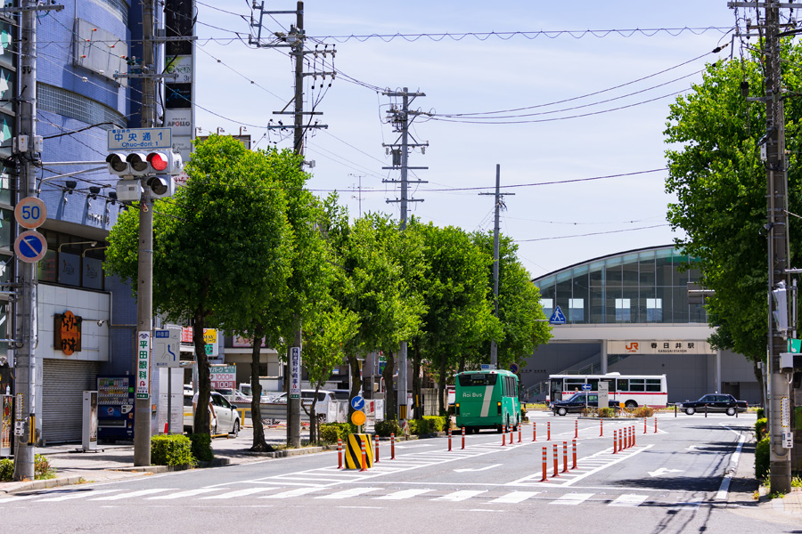
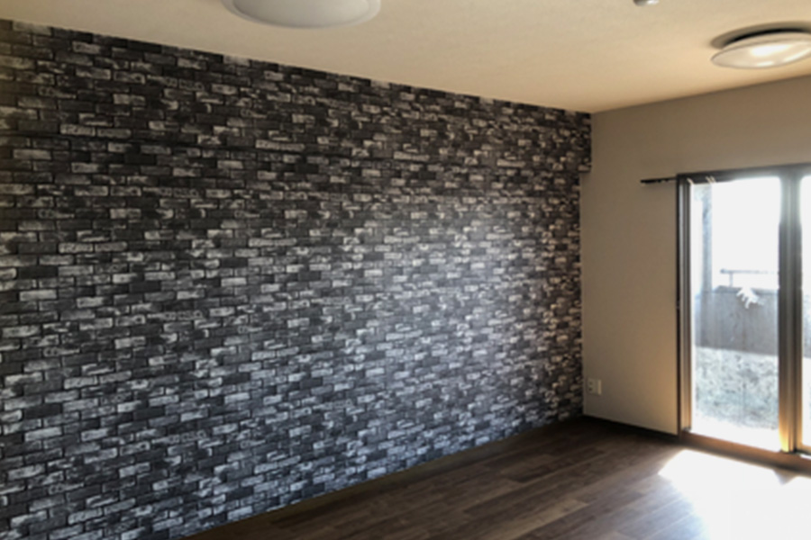
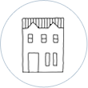
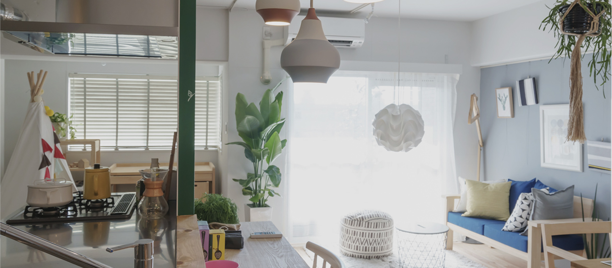
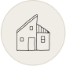
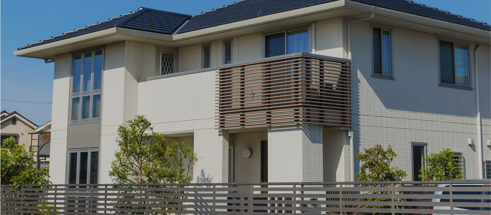

<!DOCTYPE html>
<html lang="ja">
<head>
<meta charset="UTF-8">
<meta name="viewport" content="width=device-width, initial-scale=1">
<meta name="format-detection" content="telephone=no">
<meta name="keywords" content="株式会社ウサミ建工,新築住宅,リフォーム,リノベーション,愛知県,名古屋市,西区,春日井市,清須市,不動産">
<meta name="description" content="愛知県名古屋市西区のウサミ建工は、愛知県名古屋市西区を中心に新築住宅からリフォーム・リノベーションを行っています。住宅関係をトータル的にサポートし、お客様の理想をカタチにします。">
<title>株式会社ウサミ建工　リフォーム　リノベーション　新築住宅</title>
<link rel="shortcut icon" href="favicon.ico" type="image/vnd.microsoft.icon">
<link rel="icon" href="favicon.ico" type="image/vnd.microsoft.icon">
<link rel="apple-touch-icon-precomposed" href="apple-touch-icon.png">
<link href="css/bootstrap.css" rel="stylesheet">
<link href="css/bootstrap-custom.css" rel="stylesheet">
<link href="css/bootstrap-print.css" rel="stylesheet">
<link href="css/font-awesome.min.css" rel="stylesheet">
<link href="css/style.css" rel="stylesheet">
<link href="css/hamburgers.css" rel="stylesheet">
<link href="css/vegas.min.css" rel="stylesheet">
<link href="slick/slick.css" rel="stylesheet">
<link href="slick/slick-theme.css" rel="stylesheet">
</head>
<body class="home">
<header class="main_header">
  

    

      <h1 class="logo">
        
      </h1>
      

        
ご相談・お問い合わせ

        
 0120-920-904

      

    

    

      

      

      
<a href="company.html" class="btn small">会社案内</a>

      
<a href="contact.html" class="btn small">お問い合わせ</a>

    

  

  

    
      <i class="fa fa-phone-square" alt="TEL:0120-920-904"></i>
    
  

  

    

      

    

  

</header>

  

    <nav class="main_nav">
      <ul>
        <li class="active"><a href="index.html">ホームHOME</a></li>
        <li><a href="about.html">当社についてABOUT US</a></li>
        <li class="hidden-xs"><a href="renovation.html" class="sub_nav">リフォーム・リノベーションRENOVATION</a>
          <ul class="sub">
            <li><a href="renovation.html#main02">リフォーム</a></li>
            <li><a href="renovation.html#main03">リノベーション</a></li>
          </ul>
        </li>
        <li class="visible-xs-block"><a href="renovation.html#main02">リフォームREFORM</a></li>
        <li class="visible-xs-block"><a href="renovation.html#main03">リノベーションRENOVATION</a></li>
        <li><a href="newhome.html">新築住宅NEW HOME</a></li>
        <li><a href="works.html">施工事例WORKS</a></li>
        <li><a href="voice.html">お客様の声VOICE</a></li>
        <li class="visible-xs-block"><a href="company.html">会社案内COMPNY</a></li>
        <li class="visible-xs-block"><a href="contact.html">お問い合わせCONTACT</a></li>
      </ul>
      

        
        
      

    </nav>
  

<!-- /#header -->

<main>
  <section id="main01">
    

      <h2 class="text-center mb40 xs-mb20"></h2>
      

        

          <h3 class="text-center mb20"> 
          <strong>地元・地域密着型</strong></h3>
          

        

        

          <h3 class="text-center mb20"> 
          <strong>高い技術力</strong></h3>
          

        

        

          <h3 class="text-center mb20"> 
          <strong>無料相談</strong></h3>
          

        

      

      
<a href="about.html" class="btn">詳しくはこちら<i class="fa fa-chevron-right pl10" aria-hidden="true"></i></a>

    

  </section>
  <!-- /#main01 -->
  <section id="main02">
    

      <h2 class="text-center mb30 xs-mb15"><strong>リフォーム・リノベーションで 『ありがとう』をつなげたい</strong></h2>
      
春日井市、清須市、名古屋市西部を中心に住宅についてのトータルプランをご提供致します。 
        小さな工事から大規模な改装工事までさまざまな対応が可能。 
        少しでもお客様のイメージに近づけるために、お客様に寄り添い、理想のリフォームをカタチにします。

      
<a href="renovation.html" class="btn">詳しくはこちら<i class="fa fa-chevron-right pl10" aria-hidden="true"></i></a>

    

  </section>
  <!-- /#main02 -->
  <!-- WN02 新着情報0件の時はここから削除 -->
  <section id="main03">
    

      

        

          

            <h2 class="text-center mb30 xs-mb15"></h2>

             <ul class="menu">
                 <li class="active"><a href="#cl01" data-toggle="tab">すべて</a></li>
                 <?php
                 $categories = $this->requestAction(array('controller'=>'Info','action'=>'navi'));
                 foreach($categories as $category):
                 $category = $category['CatalogCategory'];
                 ?>
                    <li><a href="#<?php echo $category['id']; ?>" data-toggle="tab"><?php echo $category['title']; ?></a></li>
                 <?php endforeach; ?>
             </ul>
 <?php $boxes_info = $this->requestAction(array('controller' => 'info', 'action' => 'widget', 'with_category' => 1, 'order' => array('CatalogBox.date1' => 'desc'))); ?>
            

              

                
<!-- 初期表示のみ、 in active クラス必須 -->
                  <table>
                      <?php
                      foreach ($boxes_info as $box):
                        extract($box['CatalogBox'], EXTR_PREFIX_ALL, 'tbl');
                        extract($box['CatalogCategory'], EXTR_PREFIX_ALL, 'cat');
                      ?>
                      <tr>
                      <td class="date <?php echo $this->Ezm->getNewMark($tbl_new_mark, $tbl_date1, 'new'); ?>">
                        
<?php echo date('Y.m.d', strtotime($tbl_date1)); ?>

                      </td>
                      <td class="cat">
                        ;"><?php echo $cat_title; ?>
                      </td>
                      <td class="area">
                        

                            <?php echo $tbl_html1; ?>
                            <?php if ($tbl_has_page == 'Y'): ?>
                                <a href="info/view/<?php echo $tbl_id; ?>" class="btn">詳細</a>
                            <?php endif; ?>
                        

                      </td>
                    </tr>
                      <?php endforeach; ?>

                  </table>
                

                  <?php
                 $categories = $this->requestAction(array('controller'=>'Info','action'=>'navi'));
                 foreach($categories as $category):
                 $category = $category['CatalogCategory'];
                 ?>
                    
">
                    <table>
                        <?php
                        foreach ($boxes_info as $box):
                        extract($box['CatalogBox'], EXTR_PREFIX_ALL, 'tbl');
                        extract($box['CatalogCategory'], EXTR_PREFIX_ALL, 'cat');
                        ?>

                        <?php if ($category['id'] == $cat_id): ?>
                            <tr>
                                <td class="date <?php echo $this->Ezm->getNewMark($tbl_new_mark, $tbl_date1, 'new'); ?>">
                                    
<?php echo date('Y.m.d', strtotime($tbl_date1)); ?>

                                </td>
                                <td class="cat">
                                    ;"><?php echo $cat_title; ?>
                                </td>
                                <td class="area">
                                    

                                        <?php echo $tbl_html1; ?>
                                        <?php if ($tbl_has_page == 'Y'): ?>
                                        <a href="info/view/<?php echo $tbl_id; ?>" class="btn">詳細</a>
                                        <?php endif; ?>
                                    

                                </td>
                            </tr>
                         <?php endif; ?>
                        <?php endforeach; ?>
                     </table>
                

                 <?php endforeach; ?>

                    <!-- LOOP -->
<!--                    <tr>
                      <td class="date new">
                        
2019.03.31

                      </td>
                      <td class="cat">
                        イベント
                      </td>
                      <td class="area">
                        
ホームページを作成致しました。今後とも宜しくお願い致します。

                      </td>
                    </tr>
                     LOOP

                  </table>
                

                

                  <table>

                     LOOP
                    <tr>
                      <td class="date new">
                        
2019.03.31

                      </td>
                      <td class="cat">
                        お知らせ
                      </td>
                      <td class="area">
                        
ホームページを作成致しました。今後とも宜しくお願い致します。

                      </td>
                    </tr>
                     LOOP

                  </table>
                

                
 初期表示のみ、 in active クラス必須
                  <table>

                     LOOP
                    <tr>
                      <td class="date new">
                        
2019.03.31

                      </td>
                      <td class="cat">
                        その他
                      </td>
                      <td class="area">
                        
ホームページを作成致しました。今後とも宜しくお願い致します。

                      </td>
                    </tr>
                     LOOP

                  </table>
                
-->

              

            

          

        

      

    

  </section>
  <!-- /#main03 WN02 新着情報0件の時はここまで削除 -->
  <section id="main04">
    

      

        

          
          

            <h2 class="text-center mb20 xs-mb10"></h2>
            

            
「今よりもっと快適に・・・」 
              お客様の生活環境の変化や好みに合わせた想いをカタチにするためのお手伝いを致します。

            

              

                <a href="renovation.html#main02" class="btn w100">リフォーム<i class="fa fa-chevron-right pl10" aria-hidden="true"></i></a>
              

              

                <a href="renovation.html#main03" class="btn w100">リノベーション<i class="fa fa-chevron-right pl10" aria-hidden="true"></i></a>
              

            

          

        

      

    

  </section>
  <!-- /#main04 -->
  <section id="main05">
    

      

        

          
          

            <h2 class="text-center mb20 xs-mb10"></h2>
            

            
Coming Soon

            

              

                <a href="newhome.html" class="btn">詳しくはこちら<i class="fa fa-chevron-right pl10" aria-hidden="true"></i></a>
              

            

          

        

      

    

  </section>
  <!-- /#main05 -->
  <section id="main06">
    

      

        <h2 class="text-center mb30 xs-mb15"></h2>
        

            <?php
            $boxes_works = $this->requestAction(array('controller' => 'works', 'action' => 'widget', 'conditions' => array('CatalogBox.on_top_page' => 'Y')));
            foreach ($boxes_works as $box): extract($box['CatalogBox'], EXTR_PREFIX_ALL, 'tbl');
            ?>

            

                <a href="works/view/<?php echo $tbl_id; ?>">

                        

                            

                                <?php if (!empty($tbl_image1)): ?>
                                    element('media', array('var' => array('id' => $tbl_image1, 'width' => 600, 'return' => true))); ?>" alt="<?php echo $tbl_image1_alt; ?>"/>
                                <?php else: ?>
                                    
                                <?php endif; ?>
                            

                        

                    
</a>
            

            <?php endforeach; ?>

        

        
<a href="works.html" class="btn">詳しくはこちら<i class="fa fa-chevron-right pl10" aria-hidden="true"></i></a>

      

    

  </section>
  <!-- /#main06 -->
</main>
<footer id="footer">
  <nav class="footer_menu">
    <ul class="footer_menu-list">
      <li><a href="index.html">ホーム</a></li>
      <li><a href="about.html">当社について</a></li>
      <li><a href="renovation.html">リフォーム・リノベーション</a></li>
      <li><a href="newhome.html">新築住宅</a></li>
      <li><a href="works.html">施工事例</a></li>
      <li><a href="voice.html">お客様の声</a></li>
      <li><a href="company.html">会社案内</a></li>
      <li><a href="contact.html">お問い合わせ</a></li>
    </ul>
  </nav>
  

    

      

        

        
〒452-0001  愛知県清須市西枇杷島町古城1-13-3

        

          
TEL 052-325-7250

          
FAX 052-938-7303

        

        

          
          
        

      

      

        

          
          
        

        

          
          <map name="Map">
            <area shape="rect" coords="20,34,168,84" href="http://www.airdan.jp/" target="_blank" alt="AIR断">
            <area shape="rect" coords="169,34,325,84" href="http://house-inspector.org/" target="_blank" alt="AJHIA">
            <area shape="rect" coords="326,34,432,86" href="https://www.reform-contact.com/" target="_blank" alt="Reform Contact">
            <area shape="rect" coords="433,32,494,87" href="https://www.jio-kensa.co.jp/" target="_blank" alt="JIO">
            <area shape="rect" coords="495,29,553,88" href="https://aichi.jyokatsu.jp/advance/authentication.html" target="_blank" alt="あいち女性輝きカンパニー">
          </map>
        

      

    

    
&copy;2019 株式会社ウサミ建工

  

</footer>

</body>
</html>
